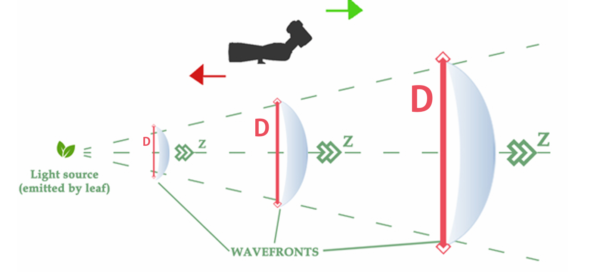

# Waveshift Augmentation (Updated Version)

This is the updated version of the README, reflecting improvements to the Waveshift augmentation technique. The latest version, **Waveshift WS 2.0**, introduces an additional hyperparameter allowing control over the aperture, further enhancing its flexibility in data augmentation.

## Table of Contents
- [Built Modular Functions](#built-modular-functions)
- [Installation](#installation)
- [Usage](#usage)
- [Approach](#approach)
- [Acknowledgements](#acknowledgements)

## Built Modular Functions

- **CCWind:** Square-crops an image to fit CNN architecture constraints (optional for other uses).
- **FT2Dc:** Applies a Fourier transform to the image.
- **IFT2Dc:** Applies an inverse Fourier transform to the image.
- **PropagatorS:** Constructs the wavefront at a given z-distance (**WS 1.0**).
- **PropagatorPSF:** Constructs the wavefront at a given z-distance with an adjustable aperture (**WS 2.0**).

## Approach

This augmentation simulates the approximated propagation of light emitted by the target (e.g., a leaf) as **spherical waves** forming along the **Z-direction** (wavefronts). The **WS 1.0** technique simulated camera shifts along these wavefronts. The updated **WS 2.0** introduces an additional hyperparameter to control the **aperture size**, allowing for more refined adjustments to light properties captured in the augmented image.



## Installation

To install the required dependencies, run:

```sh
pip install -r requirements.txt
```

## Usage

Here's how to integrate our data augmentation technique into your PyTorch data pipeline:

```python
import torch
from torchvision import transforms
import numpy as np
from PIL import Image, ImageFile
from transforms import CCWind, FT2Dc, IFT2Dc, PropagatorS, PropagatorPSF
from Waveshift import Wavefront_Shift
import matplotlib.pyplot as plt
import numpy as np

# Define the transformation pipeline
waveshift_transform = Wavefront_Shift(mode_="s")
transform_pipeline = transforms.Compose([
    transforms.Resize((512, 512)),
    waveshift_transform
])
```

Load an image and apply the Waveshift augmentation. The propagator construct is determined by a random number from **1 to 41m**, and the aperture radius is set to **0.01** by default.

```python
# Load an image
img_path = 'test.JPG'  # Replace with your image path
img = Image.open(img_path).convert('RGB')

# Apply transformations
transformed_img = transform_pipeline(img)
```

Visualize the original and augmented images side by side:

```python
# Display the original and transformed images
plt.figure(figsize=(10,5))

plt.subplot(1,2,1)
plt.imshow(img)
plt.title("Original Image")
plt.axis('off')

plt.subplot(1,2,2)
plt.imshow(transformed_img)
plt.title("Augmented Image")
plt.axis('off')
plt.show()
```

For a clearer comparison, plot the **difference image**:

```python
# Resize images to the same size
new_size = (512, 512)  # use transforms.Resize for matching
img_resized = img.resize(new_size)

# Convert resized images to numpy arrays
img_np = np.array(img_resized)
transformed_img_np = np.array(transformed_img)

# Calculate the absolute difference between the transformed image and the original image
diff = np.abs(transformed_img_np - img_np)

# Normalize the difference image to range [0, 1] for display (if needed)
diff_norm = diff / np.max(diff)

# Plotting the difference image
plt.figure(figsize=(10, 5))
plt.imshow(diff_norm, cmap='gray')  # Use 'gray' for grayscale images, or leave it for RGB
plt.title("Difference Between Original and Transformed Images")
plt.axis('off')
plt.show()
```

## Acknowledgements

This project is currently not licensed. The authors have published **WS 1.0** in *IEEE Access*, and **WS 2.0** is submitted to *Electronics*. For inquiries, please contact Gent Imeraj at gent.imeraj.9y@stu.hosei.ac.jp.

- **G. Imeraj and H. Iyatomi**, *"Waveshift Augmentation: A Physics-Driven Strategy in Fine-Grained Plant Disease Classification,"* in IEEE Access, vol. 13, pp. 31303-31317, 2025, doi: [10.1109/ACCESS.2025.3541780](https://doi.org/10.1109/ACCESS.2025.3541780).

**Keywords:** *Plant diseases, Adaptation models, Data models, Computational modeling, Cameras, Data augmentation, Wavefront shifting, Automated plant disease diagnosis.*
