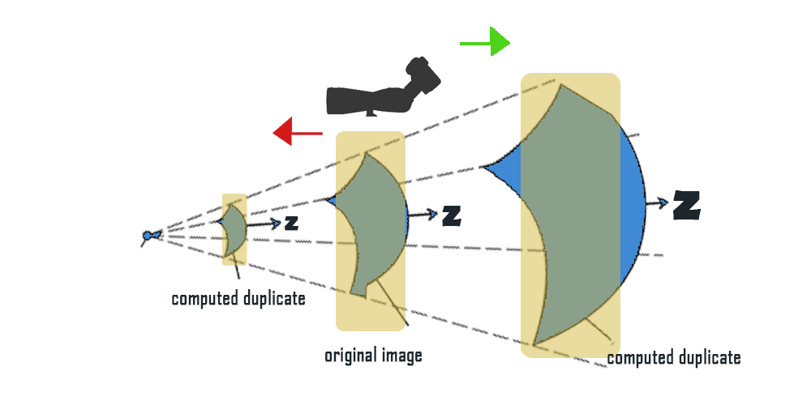

# Waveshift Augmentation
This repository contains our proposed image data augmentation technique, organized as modular functions. Our method can be easily integrated into your data preprocessing pipeline to enhance model robustness and performance. 
> The main file in this repository is Waveshift.py.

## Table of Contents
- [Transformations Included](#transformations)
- [Installation](#installation)
- [Usage](#usage)
- [Approach](#approach)
- [Acknowledgements](#acknowledgements)

## Transformations Included

- **CCWind:** Square-crops an image to fit the CNN architecture constrain (optional for other uses).
- **FT2Dc:** Applies a Fourier transform to the image.
- **IFT2Dc:** Applies an inverse Fourier transform to the image.
- **PropagatorS:** Costructs the wavefront at a given z-distance.

## Installation

To install the required dependencies, run:

`pip install -r requirements.txt`

## Approach
The approximated propagation of the light source (emitted by the target; leaf) and spherical waves created along the direction Z , named “wavefronts.” Our DA technique simulates the camera shifting along the wavefronts to acquire the image merged with light properties observed at that locatio


## Usage
Here's how to integrate our data augmentation technique into your PyTorch data pipeline:

```python
import torch
from torchvision import transforms
import numpy as np
from PIL import Image, ImageFile
from transforms import CCWind, FT2Dc, IFT2Dc, PropagatorS
from Waveshift improt Wavefront_Shift
import matplotlib.pyplot as plt
import numpy as np

# Define the transformation pipeline
waveshift_transform = Wavefront_Shift(upper_bound=41)
transform_pipeline = transforms.Compose([
    transforms.Resize((512, 512)),
    waveshift_transform,
    transforms.ToTensor()
])
```

Then, load an image that you want to apply the waveshift augmentation. Note that the propagator's construct is already determined as a random number from one up to the upper bound value of z (default to be 41m).
> We have uploaded a test leaf image for reference.

```python
# Load an image
img_path = 'test.JPG'  # Replace with your image path
img = Image.open(img_path).convert('RGB')

# Apply transformations
transformed_img = transform_pipeline(img)
```
After obtaining the augmented image, visualise the original and the augmented version side by side to see the difference.
```python
# Function to display images
def show_image(tensor_img, title=""):
    img = tensor_img.clone().detach().numpy()
    img = np.transpose(img, (1, 2, 0))
    img = np.clip(img * np.array([0.229, 0.224, 0.225]) + 
                 np.array([0.485, 0.456, 0.406]), 0, 1)
    plt.imshow(img)
    plt.title(title)
    plt.axis('off')
    plt.show()

# Display the original and transformed images
plt.figure(figsize=(10,5))

plt.subplot(1,2,1)
plt.imshow(img)
plt.title("Original Image")
plt.axis('off')

plt.subplot(1,2,2)
show_image(transformed_img, "Transformed Image")
```

## Acknowledgements
This project is currently not licensed. However, the authors have submitted the work for publication to the IEEE ACCESS Journal. For further inquiries or correspondence, please contact Gent Imeraj at gent.imeraj.9y@stu.hosei.ac.jp.
