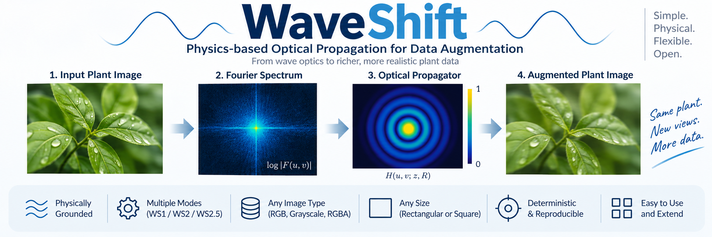
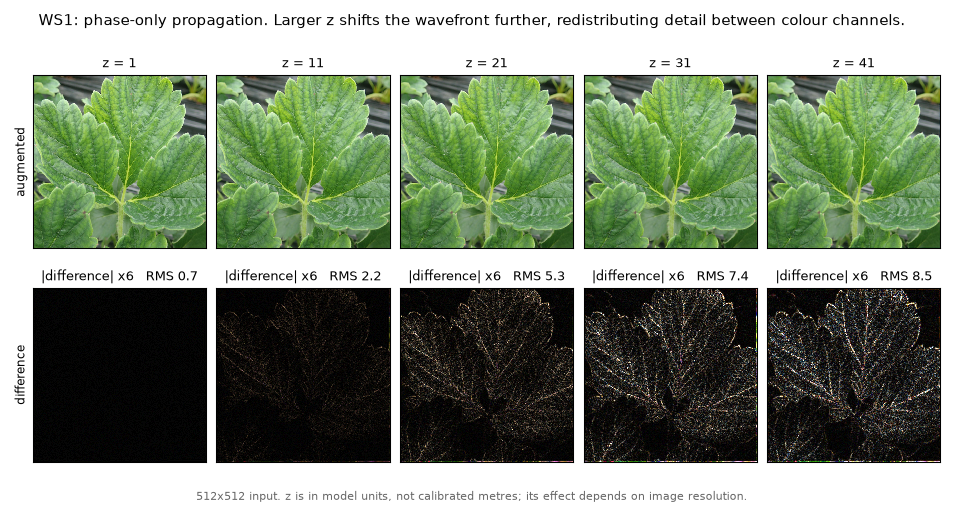
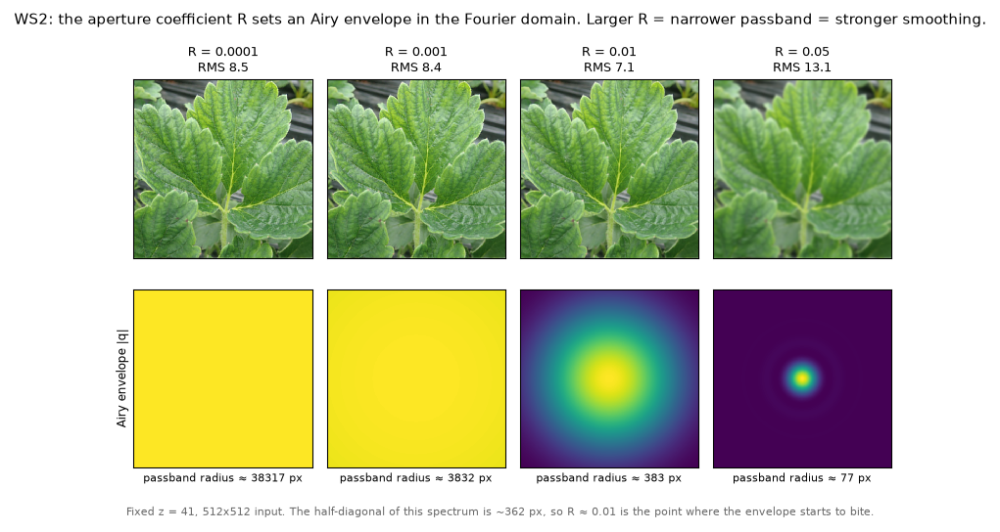
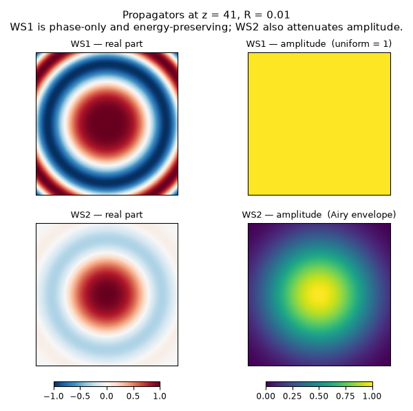
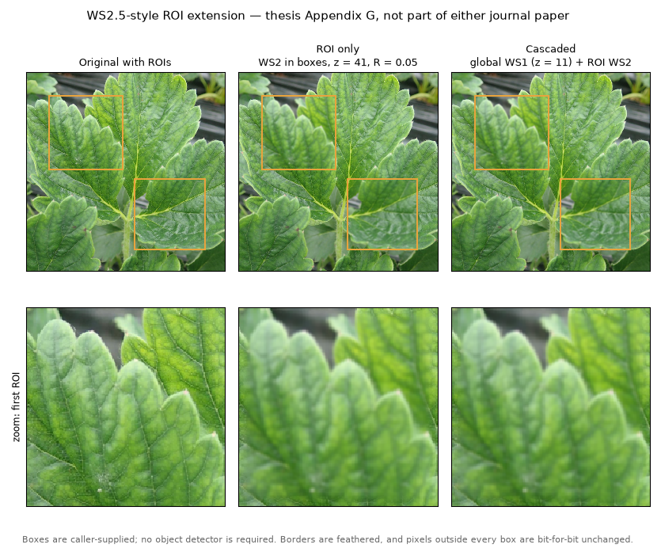

# Waveshift Augmentation

Physics-driven data augmentation for fine-grained image classification. Instead
of perturbing pixels, Waveshift propagates the image's spectrum to a nearby
wavefront and renders what the camera would have captured from a slightly
different point along that propagation.

The result is a *physically plausible re-imaging* rather than a distortion: the
subject is unchanged, but the optical path is not. Theory and derivations live
in [docs/theory.md](docs/theory.md).

## Installation

```sh
pip install -e .                     # normal use from a cloned repo
pip install -r requirements.txt      # runtime libraries only, without the package
pip install -r requirements-dev.txt  # development: editable install + tests + examples
```

Requires Python >= 3.9. Runtime dependencies are just NumPy, SciPy and Pillow.
PyTorch is **not** required — `WaveShift` is a plain callable that drops into a
`torchvision.transforms.Compose` pipeline if you already have torch installed.

## WS1 in 30 seconds

Phase-only Fresnel propagation — *IEEE Access* 2025.

```python
from PIL import Image
from waveshift import WaveShift

image = Image.open("test.JPG").convert("RGB").resize((512, 512))

transform = WaveShift(version="ws1", z_range=(1, 41))
augmented = transform(image)
```

`z` is the propagation distance, redrawn from `z_range` on every call, so the
same image yields a different augmentation each epoch.



## WS2 in 30 seconds

WS1 plus a controllable aperture — *Electronics* 2025.

```python
transform = WaveShift(
    version="ws2",
    z_range=(15, 151),
    aperture_range=(0.0001, 0.01),
)
augmented = transform(image)
```

The aperture coefficient `R` applies an Airy-disk envelope in the Fourier
domain. Larger `R` narrows the passband and smooths more aggressively.



## Deterministic usage

```python
from waveshift import waveshift

out = waveshift(image, version="ws2", z=41, aperture=0.01)
```

Fixed `z` (and `aperture`) give bitwise-identical output every time. To keep
sampling but make it reproducible, pass a seed:

```python
transform = WaveShift(version="ws1", z_range=(1, 41), seed=0)
```

The API uses a private RNG and never reads or writes global state, so results
are unaffected by `random.seed`, `np.random.seed` or `torch.manual_seed`.

## WS1 / WS2 / WS2.5

| | What it adds | Source |
|---|---|---|
| **WS1** | Phase-only propagation at distance `z`; unit modulus, energy-preserving. | *IEEE Access* 2025 |
| **WS2** | Airy-disk aperture envelope `R`; also modulates amplitude. | *Electronics* 2025 |
| **WS2.5** | Applies WS1/WS2 inside regions of interest. | **PhD thesis, Appendix G — not part of either paper** |



WS2.5 takes caller-supplied boxes; no object detector is required or bundled:

```python
from waveshift import apply_to_regions

out = apply_to_regions(
    image,
    boxes=[(60, 60, 250, 250)],   # (left, top, right, bottom)
    version="ws2", z=41, aperture=0.05,
    feather=12,
)
```



Optional `masks=` gives per-box soft compositing and `feather=` ramps the
borders. Because `z` is in pixel units, a given `z` acts more weakly on a small
ROI than on a full frame; `scale_z="area"` compensates, at the cost of the
applied `z` no longer being the one you asked for. `examples/roi_usage.py`
sketches an optional YOLOv8 integration; `ultralytics` is never imported by the
package.

## Legacy vs modern behavior

The default `compatibility="modern"` does **not** reproduce the published
numbers exactly — it corrects a coordinate off-by-one and clips instead of
wrapping. To reproduce the papers, ask for legacy behavior explicitly:

```python
out = waveshift(image, version="ws1", z=20.0, compatibility="legacy")
```

| | legacy | modern |
|---|---|---|
| coordinate grid | `arange(N) - N//2 - 1` | `arange(N) - N//2` |
| uint8 cast | truncate **and wrap** (259 -> 3) | clip to `[0, 255]` |
| inputs | square RGB only | grayscale/RGB, square/rectangular, PIL/NumPy |

The original implementation is also preserved verbatim at `waveshift.legacy`.
Both quirks are deliberate and pinned by regression tests — see
[docs/theory.md](docs/theory.md#legacy-vs-modern-implementation).

## Reproducibility

Fixed `(z, R)` is bitwise deterministic, and `seed=` makes sampled parameters
reproducible without touching global RNG state.

**Resolution matters.** `z` and `R` are expressed in pixel-index units, not
calibrated metres, so the same values produce a different effect at a different
image size. The published work resized to 512x512 — report the resolution
alongside any `(z, R)`.

Inputs may be PIL or NumPy, grayscale or RGB, square or rectangular; the output
matches the input's type, shape and dtype, and an RGBA alpha channel passes
through unchanged. `uint8` input is clipped before the cast; float input is
returned as float, unquantized.

```sh
pip install -r requirements-dev.txt
pytest                                    # incl. golden-fingerprint regressions
python smoke_test.py
python examples/basic_ws1.py              # and the other examples/
python scripts/generate_assets/generate_hero_concept.py   # regenerates docs/assets/
```

## Citation

WS1 — *IEEE Access* 2025:

```bibtex
@article{imeraj2025waveshift,
  author  = {Imeraj, Gent and Iyatomi, Hitoshi},
  title   = {Waveshift Augmentation: A Physics-Driven Strategy in
             Fine-Grained Plant Disease Classification},
  journal = {IEEE Access},
  volume  = {13},
  pages   = {31303--31317},
  year    = {2025},
  doi     = {10.1109/ACCESS.2025.3541780}
}
```

WS2 — *Electronics* 2025:

```bibtex
@article{imeraj2025waveshift2,
  author  = {Imeraj, Gent and Iyatomi, Hitoshi},
  title   = {Waveshift 2.0: An Improved Physics-Driven Data Augmentation
             Strategy in Fine-Grained Image Classification},
  journal = {Electronics},
  volume  = {14},
  number  = {9},
  pages   = {1735},
  year    = {2025},
  doi     = {10.3390/electronics14091735}
}
```

WS2.5 — ROI extension, PhD thesis:

```bibtex
@phdthesis{imeraj2025thesis,
  author = {Imeraj, Gent},
  title  = {Machine Learning Across Light and Language: Toward Robust and
            Interpretable Fine-Grained Image Classification},
  school = {Hosei University},
  year   = {2025},
  month  = {July},
  note   = {WS2.5 / ROI-based multi-aperture augmentation: Appendix G}
}
```

The algorithm builds on T. Latychevskaia and H.-W. Fink, "Practical algorithms
for simulation and reconstruction of digital in-line holograms," *Appl. Opt.*
**54**, 2424-2434 (2015).

## License

**License:** No license file is present yet, so the default
applies: all rights reserved, and others cannot legally reuse this code even
though it accompanies published papers. This is a release blocker — pick a
license before announcing the package. For inquiries, contact Gent Imeraj.
