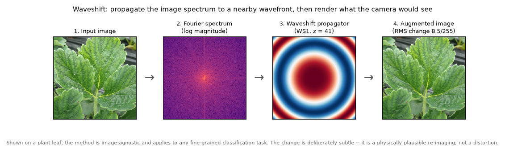
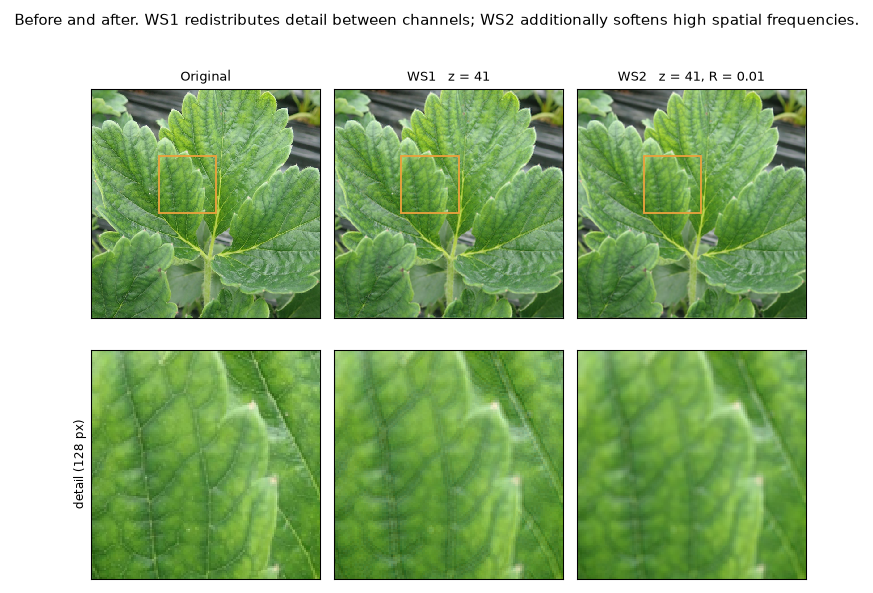

# Waveshift: theory



## From wave equation to propagator

*To be written.* Sketch: scalar Helmholtz equation → angular spectrum →
paraxial (Fresnel) approximation → the transfer function

$$p(u,v) = \exp\!\big(-i\pi\lambda z (u^2+v^2)\big)$$

applied as a multiplication in the Fourier domain. The implementation follows
the algorithms in Latychevskaia & Fink, *Appl. Opt.* **54**, 2424–2434 (2015).

## WS1: z and phase modulation


Top row: WS1's real part shows the concentric Fresnel rings, and its amplitude
is uniformly 1 — the propagator is pure phase. Bottom row: WS2 damps both.



*To be written.* WS1 is **phase-only**: `|p| = 1` everywhere, so the propagator
is energy-preserving. The augmentation comes from the per-channel wavelength
difference (620 / 535 / 450 nm) at a shared `z`, which produces a small
chromatic redistribution rather than a blur.

## WS2: aperture/R and amplitude modulation

*To be written.* WS2 multiplies the WS1 phase by an Airy-disk intensity
envelope for a circular aperture,

$$A(u,v) = \left(\frac{2J_1(Rr)}{Rr}\right)^{2}, \qquad r=\sqrt{u^2+v^2},$$

so WS2 is **amplitude-modulating as well as phase-modulating**. Larger `R`
shrinks the Airy main lobe and suppresses more high-frequency content.


The bottom row of that figure is the envelope `|q|` actually applied in the
Fourier domain — it is what makes the attenuation legible.

Two points to expand here:

- The Airy *intensity* (squared) is used directly as a Fourier-domain transfer
  function. A strictly incoherent model would convolve with the intensity PSF
  (multiply by its OTF); a coherent pupil model would use the unsquared
  amplitude `2J₁(x)/x`. The squared form is a deliberate modelling choice,
  consistent across the MATLAB reference and the Python implementation.
- The first zero of the Airy pattern sits at `r = 3.8317 / R`. At `R = 0.01`
  that is ≈ 383 px, against a half-diagonal of ≈ 362 px for a 512×512
  spectrum — so the published default places the main lobe just around the
  image spectrum.

## Units and the resolution caveat

**This matters more than it looks.** In the implementation `u` and `v` are
*integer pixel indices*, not calibrated spatial frequencies: there is no pixel
pitch `dx` in the expression. The physical Fresnel kernel would use
`f = u/(N·dx)`.

Consequences:

- `λ·z` is a **lumped empirical parameter**, not a calibrated distance in
  metres. The "metres" in the API is a model unit.
- `R` has units of 1/pixel.
- **The same `(z, R)` produces a different effect at a different image
  resolution.** Measured RMS change for WS1 at `z = 20`:

  | N | RMS change | max phase |
  |---|---|---|
  | 128 | 0.076 | 0.05 cycles |
  | 256 | 0.703 | 0.20 cycles |
  | 512 | 5.841 | 0.81 cycles |
  | 1024 | 9.974 | 3.25 cycles |

  The published pipeline resized to 512×512, so that resize is **load-bearing**,
  not cosmetic. Report the resolution alongside any `(z, R)`.

## WS2.5: ROI / multi-aperture extension


*To be written.* This is the **PhD thesis extension (Appendix G)**, not part of
either journal paper — cite it as the thesis.

Waveshift is applied inside caller-supplied regions and composited back, with
optional soft masks and feathered borders. Because of the resolution caveat
above, a given `z` acts more weakly on a small ROI than on a full frame;
`scale_z="area"` compensates by scaling `z` with the squared diagonal ratio,
at the cost of the applied `z` no longer being the `z` requested.

No detector is required or bundled. `examples/roi_usage.py` sketches an
optional YOLOv8 integration, which is never imported by the package.

## Legacy vs modern implementation

| | legacy | modern |
|---|---|---|
| coordinate grid | `arange(N) - N//2 - 1` → `[-257, 254]` at N=512 | `arange(N) - N//2` → `[-256, 255]` |
| centring | one pixel off-centre; propagator is not centro-symmetric | zero on the DC bin |
| FFT | checkerboard `(-1)^(i+j)`; identical to modern for even sizes | `fftshift(fft2(ifftshift(·)))` |
| uint8 cast | truncate **and wrap**: 259.4 → 3 | clip to `[0, 255]`, then cast |
| shapes | square RGB only | grayscale/RGB, square/rectangular, PIL/NumPy |
| randomness | Python global `random` | private `numpy.random.Generator` |

The off-by-one came from transliterating 1-based MATLAB indices to 0-based
NumPy: MATLAB's `(1:N) - N/2 - 1` spans `[-N/2, N/2-1]`, while NumPy's
`arange(N) - N//2 - 1` spans `[-N/2-1, N/2-2]`. The MATLAB reference is
therefore equivalent to the *modern* grid.

Legacy behavior is preserved because the published results were generated with
it. Use `compatibility="legacy"` to reproduce them exactly; the regression
suite pins both fingerprints.

## Archived exploratory animations

These render the WS2 propagator surface under hyperparameter extensions beyond
the physically meaningful regime — sign-inverted and imaginary `(z, R)`. They
are **not** used by the augmentation pipeline; they illustrate the sensitivity
and constraints of the formulation. Large files, kept for provenance:

- [`assets/PropagatorPSF_0.01.gif`](assets/PropagatorPSF_0.01.gif) — original `(z, R)`
- [`assets/PropagatorPSF_acneg_zpos.gif`](assets/PropagatorPSF_acneg_zpos.gif) — sign-inverted `(z, -R)`; visually near-identical to the original, which is the point
- [`assets/PropagatorPSF_inv_acimag_zreal.gif`](assets/PropagatorPSF_inv_acimag_zreal.gif) — imaginary `z`, behaves like a high-pass filter
- [`assets/PropagatorPSF_inv_acimag_zimag.gif`](assets/PropagatorPSF_inv_acimag_zimag.gif) — imaginary `z` and `R`; diffraction structure breaks down

Two further orphaned visuals are kept in [`assets/archive/`](assets/archive/).

## Regenerating the figures

Every PNG in `assets/` is produced deterministically by a script in
`scripts/generate_assets/`; re-running one reproduces the same file.

```sh
pip install -r requirements-dev.txt
python scripts/generate_assets/generate_hero_concept.py
python scripts/generate_assets/generate_ws1_z_sweep.py
python scripts/generate_assets/generate_ws2_aperture_sweep.py
python scripts/generate_assets/generate_propagator_panels.py
python scripts/generate_assets/generate_before_after_grid.py
python scripts/generate_assets/generate_roi_example.py
```

## References

- G. Imeraj and H. Iyatomi, "Waveshift Augmentation: A Physics-Driven Strategy
  in Fine-Grained Plant Disease Classification," *IEEE Access* **13**,
  31303–31317 (2025). doi:[10.1109/ACCESS.2025.3541780](https://doi.org/10.1109/ACCESS.2025.3541780)
- G. Imeraj and H. Iyatomi, "Waveshift 2.0: An Improved Physics-Driven Data
  Augmentation Strategy in Fine-Grained Image Classification," *Electronics*
  **14**, 1735 (2025). doi:[10.3390/electronics14091735](https://doi.org/10.3390/electronics14091735)
- G. Imeraj, *Machine Learning Across Light and Language: Toward Robust and
  Interpretable Fine-Grained Image Classification*, PhD thesis, Hosei
  University (2025). WS2.5 is Appendix G.
- T. Latychevskaia and H.-W. Fink, "Practical algorithms for simulation and
  reconstruction of digital in-line holograms," *Appl. Opt.* **54**, 2424–2434
  (2015).
